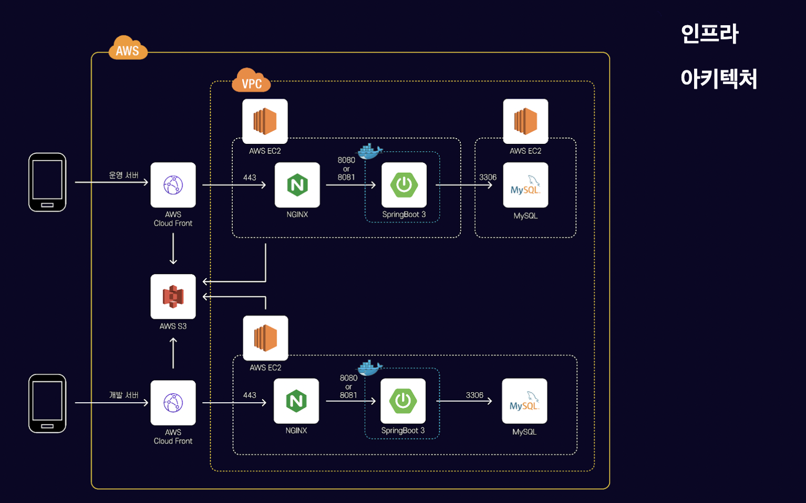
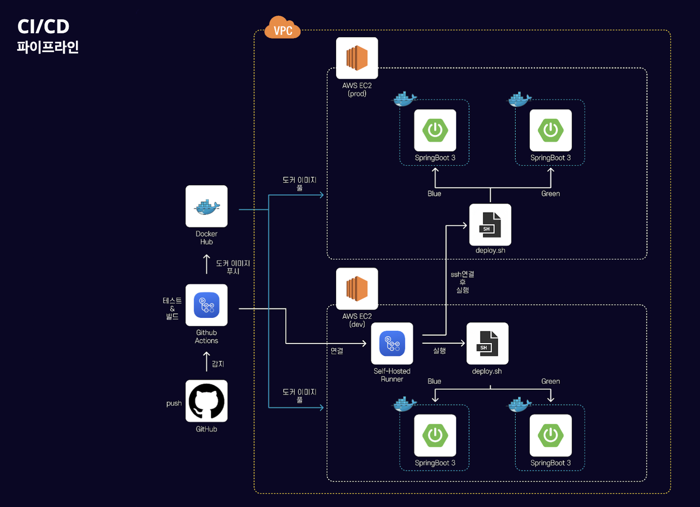

# 🚶🏻‍♀️ NAAGA-Project-records  

## 나아가 
장소의 사진을 보고 걸어다니며 당신이 몰랐던 명소를 발견해 보세요, 나아가 🚶🏻‍♀️

> 장소의 사진을 보고 걸어다니며 추리의 재미를 느끼고 명소도 발견하는 서비스

- [나아가 Github](https://github.com/woowacourse-teams/2023-naaga)
- [나아가 소개 링크](https://sites.google.com/woowahan.com/woowacourse-demo-5th/%ED%94%84%EB%A1%9C%EC%A0%9D%ED%8A%B8/%EB%82%98%EC%95%84%EA%B0%80)

## 소개

## 백엔드 기술 스택

## 인프라 아키텍처

## CI/CD

- CI
    - 정기적인 빌드 및 테스트(유닛테스트 및 통합테스트)를 거쳐 공유 레포지터리에 병합되는 과정
- CD
    - 레포지터리에서 실시간으로 프로덕션 환경으로 배포하는 작업을 자동화하는 것     

사용자의 피드백을 적극 반영하기 위해 짧은 주기로 서비스를 배포하고 있습니다.
잦은 빌드와 배포로 인해 번거로움을 느꼈고 CI/CD 환경을 구성하여문제를 해결하였습니다.

