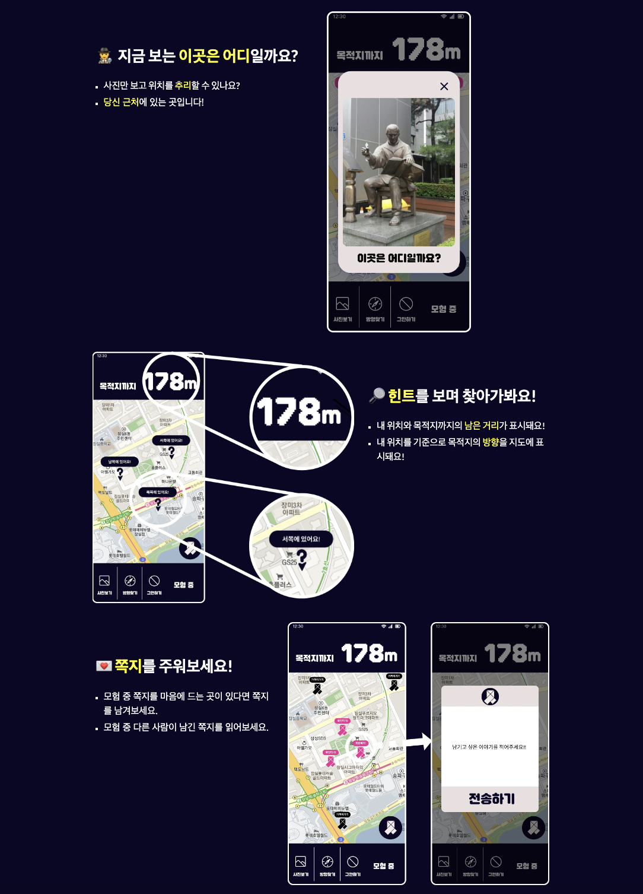
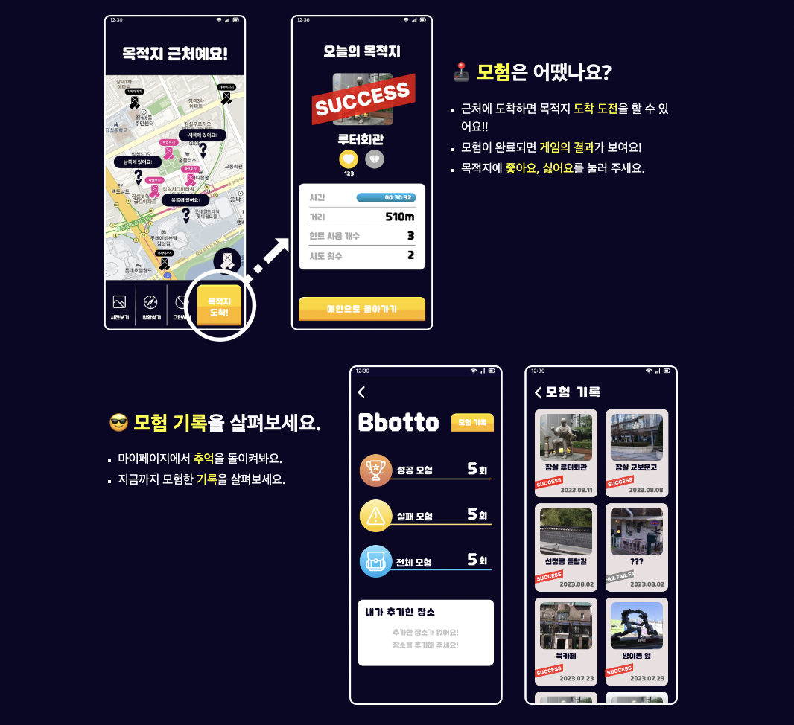
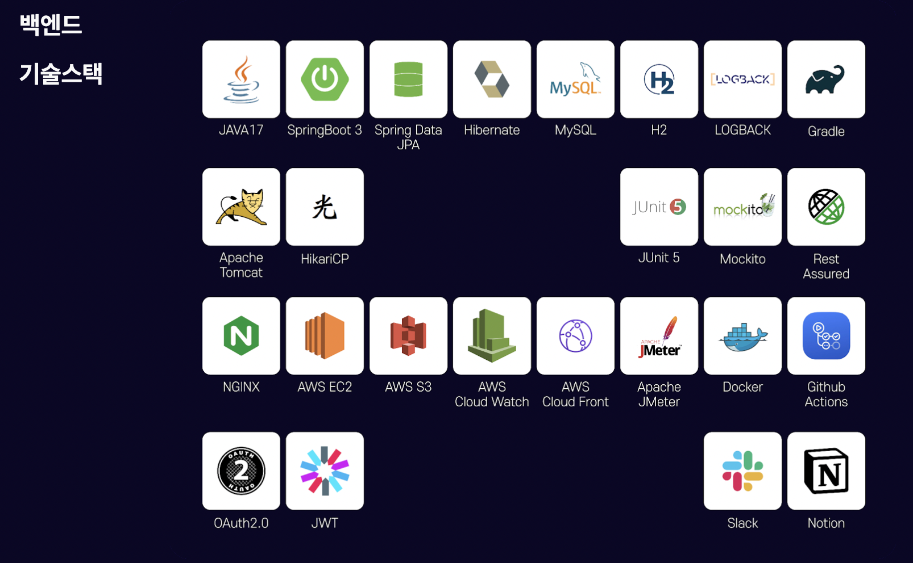
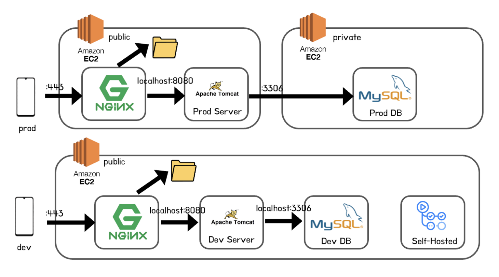
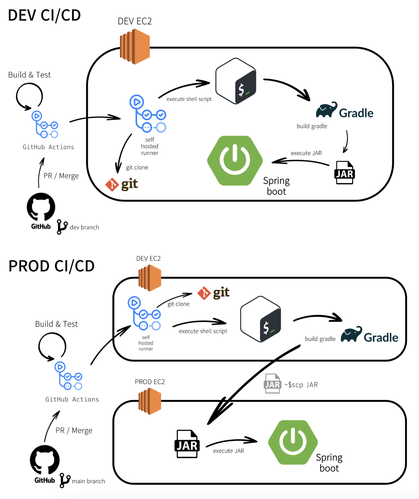

# 🚶🏻‍♀️ NAAGA-Project-records
#### 본 저장소의 목적은 [우아한테크코스 팀 프로젝트](https://github.com/woowacourse-teams) 를 진행하면서 했던 내용들을 정리하는 것입니다.  

## 나아가 
장소의 사진을 보고 걸어다니며 당신이 몰랐던 명소를 발견해 보세요, 나아가 🚶🏻‍♀️

> 장소의 사진을 보고 걸어다니며 추리의 재미를 느끼고 명소도 발견하는 서비스

- [나아가 Github](https://github.com/woowacourse-teams/2023-naaga)

## 소개

## 백엔드 기술 스택

## 프로젝트 아키텍처

## CI/CD

- CI
    - 정기적인 빌드 및 테스트(유닛테스트 및 통합테스트)를 거쳐 공유 레포지터리에 병합되는 과정
- CD
    - 레포지터리에서 실시간으로 프로덕션 환경으로 배포하는 작업을 자동화하는 것     

사용자의 피드백을 적극 반영하기 위해 짧은 주기로 서비스를 배포하고 있습니다.
잦은 빌드와 배포로 인해 번거로움을 느꼈고 CI/CD 환경을 구성하여문제를 해결하였습니다.

## My Task
#### 프로덕트 서버 구축
- EC2 인스턴스 내부에 필요한 환경을 설정하고 서버를 구축한다.
- Nginx와 스프링 부트를 설치하고, Nginx와 스프링 부트 간의 연동 구현한다.
- Msql을 설치하여 스프링 부트와 데이터베이스 접근을 관리한다.

#### 기능 구현
- 플레이어의 게임 결과를 분석하여 보여주고, 전체 게임의 결과들을 보여준다.
- 통계를 계산하여 사용자에게 제공한다.
- 카카오 로그인을 구현하여 사용자의 인증 및 인가 과정을 처리한다.
- 모든 플레이어의 랭크와 개인 랭크를 계산하여 사용자에게 제공한다.

#### 유지보수
- 로그전략을 작성하고 구현하여 로그를 관리한다.

## Layered Architecture
도메인 설계 할 때 도메인을 관심사 별로 묶고 **모듈 간의 의존성은 최소화하고, 응집성은 최대화** 할 수 있도록 Layered Architecture 따라 설계를 하였습니다.

# Level 3
  * [도메인 설계](#도메인-설계)
  * [기술스택을 선택한 이유](#기술스택을-선택한-이유)
  * [Spring Securtiy](#spring-securtiy)
  * [HTTPS](#https)
  * [Oauth2](#oauth2)
  
    
## 도메인 설계
 

## 기술스택을 선택한 이유

🤵[기술스택을 선택한 이유](TroubleShoot.md)

